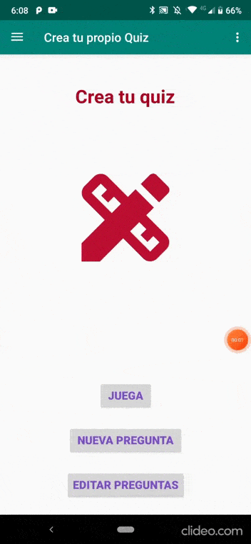
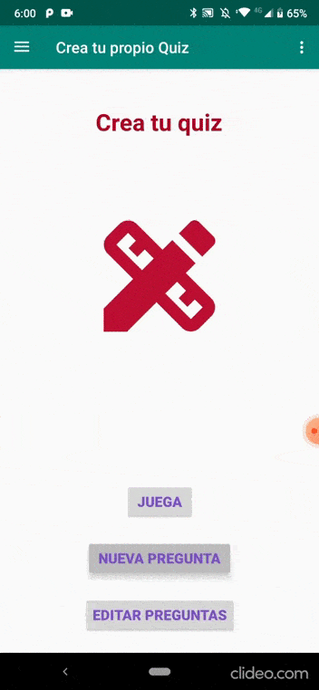
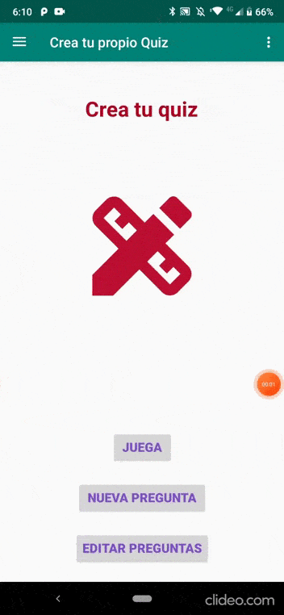

# Crea tu quiz

Esta es una aplicación que permite de forma divertida solucionar preguntar de respuestas multiple para repasar temas que sean importantes para ti, se pueden crear las propias preguntas y cuenta con un tiempo limite para responder estar preguntas.

## Tecnologia aplicada

MVVM: arquitectura.  
Room: Base de datos local.  
Corutines: corutinas para manejar ejecucion de codigo asincrono. 
Paging: Paginacion al mostrar preguntas en RecyclerView. 
Navigation: navegacion entre fragments.  
DataBinding: Union entre componentes layout y controladores.  
Notification: Notifica cuando el tiempo termina.  
BroadCast: Se suscribe al evento de que el tiempo se termine.  
Test: UI test Espresso.  

## Aplicación

Acceso al menu y navigation drawer que permite ver las reglas del juego y de que se trata.

Comienza a jugar, resuleve tods las reguntas dentro del tiempo y ganas.

Despues de los 10 segundos asignados sin responder la preguntas perderas y se mostrara una notificacion.

Crea una nueva pregunta para este proceso se implemente un UI test con espresso.

Elimina una o todas las preguntas que has creado, las puedes observar todas en una lista

## License

Application developed by Miguel Angel Bello Garcia, github @miguelmabellog

